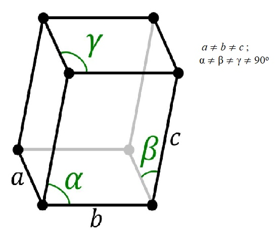

# Crystal-Cell-Brave
AR project

Приложение создано для андроид.
При наведении камеры на маркеры, будет выводится информация и включаться аудиофайл.

The application is created for android.
When you point the camera at the markers, information will be displayed and the audio file will be turned on.

### EU: Markers that the application recognizes // RU: Маркеры, которые распознает приложение

